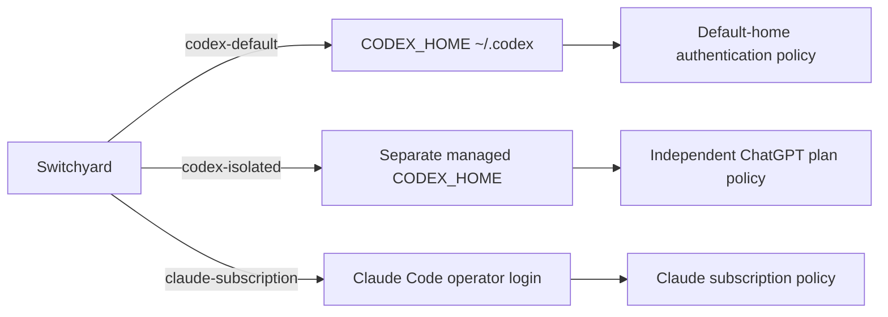

# Provider identities

## Purpose

Switchyard routes work to an explicit authentication and policy context. This prevents a generic `codex` invocation from silently selecting whichever credential happens to be active in the parent process.

## Claude subscription identity

`claude-subscription` names the operator-managed Claude Code login. Switchyard does not manage, copy, or inspect Claude credential material. If the official CLI reports unauthenticated, live dispatch is unavailable until the operator completes Claude's official login flow.

## Codex default identity

`codex-default` pins `CODEX_HOME` to the operator's existing default Codex home at `~/.codex`. Switchyard does not create, rewrite, or log credentials in this home. The routing name is stable even if the operator changes that home's authentication; doctor reports the observed mode explicitly.

## Codex isolated identity

`codex-isolated` uses `~/.agent-switchyard/codex/isolated` for new setups. Switchyard creates the directory with private permissions and a configuration requiring file-backed credential storage. Before invoking Codex, it sets that `CODEX_HOME` and removes inherited `OPENAI_API_KEY` and `CODEX_ACCESS_TOKEN` values so they cannot override the stored ChatGPT session.

Development installations created before the generic rename continue using the previously prepared isolated home when it exists. Switchyard selects that directory by existence only and never reads its credential files.

The operator authenticates through the official `codex login` browser or device-code flow. Switchyard never reads or prints `auth.json`.

## Invariants

- Each dispatch record names a provider identity.
- Identity environment overrides apply to version checks, doctor probes, live probes, and future task execution.
- Credential files remain outside Git and outside all handoffs and reports.
- Existing configuration is not overwritten. Login is refused if the managed Enterprise configuration no longer guarantees file-backed isolation.
- Authentication mode is observed through redacted provider health output and normalized as API key, subscription, access token, or unknown.

## Implementation map

- `src/config/codex-identities.ts` defines identity homes and environment boundaries.
- `src/auth/codex.ts` prepares the managed home and launches official authentication.
- `src/providers/codex.ts` applies the selected identity to doctor commands.
- `src/probes/codex-live.ts` applies and reports the selected identity for explicit live probes.
